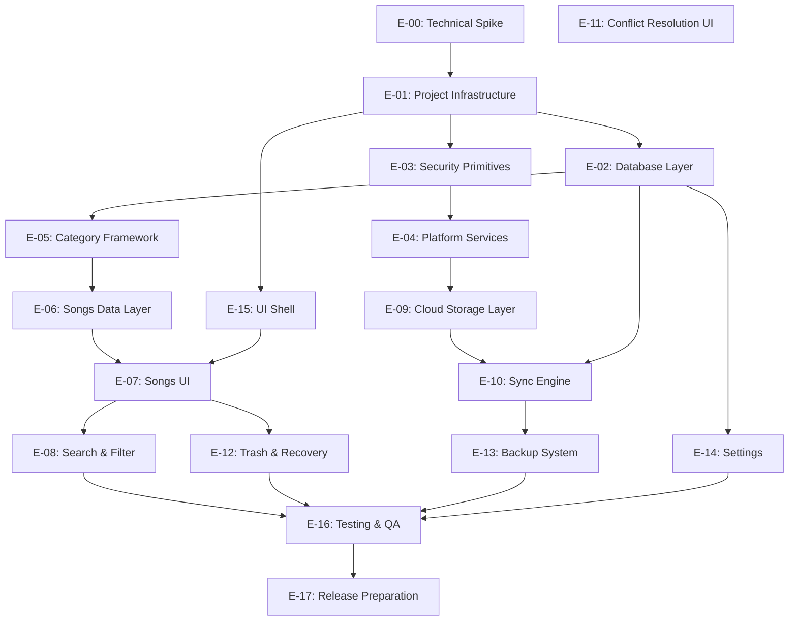

# PROJECT CONSTITUTION

## Personal Collection Manager

### Version 1.1 — Architectural Foundation Document

**Classification:** Design Authority Document
**Status:** Adopted
**Target Audience:** Implementation Agents, Technical Leads, Solo Developer
**Date:** 2026-06-17
**Revision:** v1.1 — Option A (React Native + RNW) abandoned after E-00 Technical Spike. Architecture revised to Electron (Windows) + Capacitor + React (Android). Database schema, sync model, security model, category framework, and all requirements are preserved.

---

> **How to Use This Document**
> This constitution is the single source of truth for all architectural and product decisions.
> Every implementation task, coding agent prompt, and design review must trace back to a decision recorded here.
> When a requirement is ambiguous, this document governs. When this document is ambiguous, update it before writing code.

---

# PART I — PRE-IMPLEMENTATION ANALYSIS

This section must be read before the constitution proper. It identifies gaps, challenges assumptions, and flags risks that informed every decision in Parts II–IV.

---

## Section 1 — Missing Requirements

The following requirements were absent from the product brief and have been resolved, deferred, or flagged for product decision before implementation begins.

| ID    | Area          | Gap                                                        | Resolution                                                                                                                        |
| ----- | ------------- | ---------------------------------------------------------- | --------------------------------------------------------------------------------------------------------------------------------- |
| MR-01 | Auth          | Password change flow not defined                           | **Out of scope for V1.** Future implementation path documented in Section 16.                                                     |
| MR-02 | Auth          | Session persistence policy unclear                         | **Resolved.** Derived AES key stored in platform secure storage. No auto-expiry in V1.                                            |
| MR-03 | Auth          | Google account change behavior not defined                 | **Out of scope for V1.** Known limitation documented in Section 16.                                                               |
| MR-04 | Data          | Trash retention period not specified                       | **Resolved.** Indefinite retention in V1. No automatic purge. Hook for future policy retained.                                    |
| MR-05 | Data          | Initial language seed list not defined                     | Seeded with ~60 languages from ISO 639-1. User additions are flagged.                                                             |
| MR-06 | Data          | No import/export capability defined                        | **Out of scope for V1.** Future implementation path documented in Section 21.                                                     |
| MR-07 | Data          | Schema migration strategy absent                           | Defined in Section 13. Sequential numbered migrations, version tracked in DB.                                                     |
| MR-08 | Platform      | Android minimum API level not specified                    | **PRODUCT DECISION REQUIRED.** Recommendation: Android API 26 (Android 8.0).                                                      |
| MR-09 | Platform      | Windows minimum version not specified                      | **PRODUCT DECISION REQUIRED.** Recommendation: Windows 10 version 1903+.                                                          |
| MR-10 | UX            | Offline first-launch experience undefined                  | **Resolved.** Internet required for initial setup. Fully offline after first setup completes.                                     |
| MR-11 | Sync          | Multi-device simultaneous edit window not addressed        | Addressed in Section 15. Record-level change tracking uses Last-Write-Wins (LWW) to resolve cross-device conflicts automatically. |
| MR-12 | Data          | Name normalization rules unspecified                       | **Resolved.** Deterministic normalization: NFC, lowercase, whitespace collapse. No fuzzy match.                                   |
| MR-13 | Data          | Fuzzy match parameters for duplicate detection unspecified | **Removed.** Fuzzy/probabilistic matching is out of scope for V1. Replaced by MR-12.                                              |
| MR-14 | Accessibility | No accessibility requirements defined                      | **Out of scope for V1.** Architecture must not block future accessibility improvements.                                           |
| MR-15 | i18n          | UI language not specified                                  | V1: English only. Architecture must not prevent future localization.                                                              |
| MR-16 | Security      | No recovery path for forgotten password                    | **Resolved.** No recovery path in V1. Prominently disclosed at initial setup. See Section 16.                                     |
| MR-17 | UX            | Application name and branding not specified                | **PRODUCT DECISION REQUIRED.** Placeholder: "Collectio".                                                                          |

---

## Section 2 — Challenged Assumptions

### CA-01: Architecture Revision — React Native for Windows is not viable

**This assumption has been validated and confirmed by the E-00 Technical Spike.**

The E-00 spike executed 7 validation tasks on a React Native for Windows (RNW) scaffold. Results:

- **6 of 7 tasks passed:** SQLite reads/writes/CRUD, AES-256-GCM encrypt/decrypt, Argon2id key derivation (WASM, within budget), Google OAuth PKCE browser flow, `react-native-keychain` Windows Credential Manager read/write, and Google Drive REST API upload/download.
- **1 of 7 tasks failed:** Foreign key enforcement via `react-native-sqlite-storage` on RNW. The `PRAGMA foreign_keys = ON` directive was not honored by the package bridge. The SQLite engine itself functions correctly (11/12 tests passed) — the issue is in the package's RNW binding layer.

The spike concluded that while the SQLite engine works, the package ecosystem gap creates disproportionate risk and complexity. After analysis, the architecture was revised to:

- **Windows:** Electron — mature desktop framework with native Node.js SQLite (`better-sqlite3`), crypto, and OAuth support. Eliminates all RNW ecosystem risks.
- **Android:** Capacitor + React (web) — wraps a web React app in a native WebView with Capacitor plugin access to SQLite, keychain, and OAuth. The same React web UI renders in both environments.

**Platform-specific code remains isolated behind interfaces.** The pattern of abstraction identified in the original CA-01 is preserved — only the target platforms changed. Database schema, sync model, security model, category framework, and all functional requirements remain identical.

### CA-02: Full-database sync eliminates the need for record-level change tracking

**This assumption is false.**

When the full encrypted database file is swapped between cloud and local, conflict detection cannot occur at the file level — two files that are both valid databases with differing content cannot be automatically merged. Record-level change metadata (`updated_at`, `deleted_at`) is mandatory regardless of the sync transport mechanism. The "full file upload" refers to the transport layer, not the merge layer.

### CA-03: The 2-minute inactivity timer prevents sync conflicts

**This assumption is partially false.**

The timer prevents rapid consecutive edits on a single device from triggering multiple uploads. It does not prevent two devices from both being active simultaneously and making independent changes before either syncs. With 4 active devices, cross-device conflicts are a routine operating condition. Conflicts are resolved automatically using Last-Write-Wins (LWW) based on timestamps.

### CA-04: No password recovery is acceptable for a personal tool

**This assumption has been reviewed and accepted by the product owner for V1.**

The consequence is narrower than it first appears: the local SQLite database on each active device is not encrypted. A user who forgets their master password retains full access to their data on any device where the app is installed. What is lost is the ability to sync (cloud backup requires re-encryption) and the ability to onboard new devices from the cloud backup.

The cloud-only data loss scenario (user's only device is wiped, forgets password) is accepted as a known risk for V1. It is prominently disclosed at initial setup. The encrypted file format includes a format version byte, leaving a clear extension point for a future Recovery Key feature that requires no server infrastructure. See Section 16.4.

### CA-05: Google Drive is sufficient as the only sync target

**Acceptable for V1, but creates lock-in if not abstracted.**

A `CloudStorageProvider` interface must be defined. Google Drive is the only implementation in V1. This interface must be the only contract the sync engine knows about. Adding Dropbox, OneDrive, or self-hosted WebDAV in V2 must not require changes to the sync engine.

### CA-06: Local and cloud databases use the "same schema"

**Clarification required, not a challenge.**

"Same schema" means identical logical table structure. They differ in one way: the cloud copy is the entire SQLite file encrypted with AES-256-GCM at the byte level before upload. The local database is unencrypted at the file level (the device's OS provides file system security). Both instances contain identical table definitions. This is the correct interpretation.

---

## Section 3 — Identified Risks (Summary)

Detailed risk analysis is in Section 20. Summary:

| Risk ID | Description                                             | Severity | Mitigation                                                                                            |
| ------- | ------------------------------------------------------- | -------- | ----------------------------------------------------------------------------------------------------- |
| R-01    | Capacitor SQLite plugin reliability (community-maintained, not Capacitor core) | High     | Validate `@capacitor-community/sqlite` in Phase 0b spike. Fallback: custom Capacitor SQLite plugin.   |
| R-02    | Argon2id WASM performance on low-end Android devices    | Medium   | Benchmark on minimum-spec device (API 26, 2GB RAM). Fallback: PBKDF2 with documented security tradeoff.|
| R-03    | Electron app bundle size (~100MB+ with Chromium)        | Low      | Acceptable for Windows desktop. Mitigated by `electron-builder` compression.                          |
| R-04    | Dual build pipeline complexity (electron-builder + Capacitor CLI) | Medium   | CI runs both in parallel. Documented as TD-08.                                                        |
| R-05    | Forgotten password → cloud backup unrecoverable         | Medium   | Accepted for V1. Local DBs on active devices remain accessible. Disclosed at setup. See Section 16.4. |
| R-06    | Concurrent 4-device editing produces frequent conflicts | Medium   | Automated conflict resolution using Last-Write-Wins (LWW) ensures no UI blockers for edge cases.      |
| R-07    | SQLite schema migrations across app versions            | Medium   | Versioned migration system from day one                                                               |
| R-08    | Google OAuth token expiry during extended offline use   | Medium   | Graceful degradation; local operation always possible                                                 |
| R-09    | Android WebView version fragmentation (older WebView on API 26 devices) | Low      | WebView auto-updates via Play Store on Android 5+. Test on minimum spec.                              |
| R-10    | Google Drive API rate limits                             | Very Low | Drive REST API limits are generous for single-user; exponential backoff on rate limit response        |

---

## Section 4 — Technical Debt Flags

These are architectural decisions that are acceptable for V1 but will require revisitation as the product evolves. Each has a **TD** identifier for traceability.

| TD-ID | Decision                          | Debt Created                                              | Future Trigger                                         |
| ----- | --------------------------------- | --------------------------------------------------------- | ------------------------------------------------------ |
| TD-01 | Full-file sync transport          | Replacing transport requires sync engine changes          | DB size exceeds ~50 MB or incremental sync is demanded |
| TD-02 | Single Google Drive provider      | Adding alternative providers requires new implementations | User requests alternative storage                      |
| TD-03 | No import capability in V1        | Users cannot migrate from other tools                     | User adoption pressure                                 |
| TD-04 | Indefinite trash retention        | Hook for configurable retention policy must remain        | User requests auto-purge or DB size grows              |
| TD-05 | English-only UI strings hardcoded | Full localization requires string extraction refactor     | Internationalization requirement                       |
| TD-06 | No password recovery path in V1   | Cloud backup unrecoverable if password forgotten          | First cloud-only data loss incident; see Section 16.4  |

---

# PART II — PRODUCT AND ARCHITECTURE

---

## Section 5 — Executive Summary

The Personal Collection Manager is a cross-platform, offline-first application for managing personal metadata collections. Version 1 delivers Songs management; the architecture is explicitly designed to accommodate Books, Movies, Games, and additional categories through software updates without requiring structural rewrites.

The application runs on Windows and Android using a shared React (web) codebase — distributed via Electron on Windows and Capacitor + WebView on Android. Every device maintains a local SQLite database as the primary working store. Google Drive serves as the synchronization and encrypted backup layer. A master password, combined with the user's email address, derives the AES-256-GCM key used to encrypt the cloud copy of the database.

The architecture prioritizes simplicity, reliability, and data integrity over engineering sophistication. Expected scale is one user, four devices, and up to 10,000 entries. No premature optimization is applied. Every component is selected to remain maintainable by a small team or solo developer.

---

## Section 6 — Product Vision

### 6.1 Mission Statement

A reliable, private, offline-capable personal catalogue that the user owns entirely — no subscriptions, no cloud accounts required to use it locally, no vendor access to personal data.

### 6.2 Design Philosophy

**Simplicity over features.** Every feature must justify its existence. A feature not built cannot break.

**Reliability over novelty.** Proven technologies are preferred. SQLite, AES-256-GCM, and OAuth 2.0 are mature, well-understood, and well-supported.

**Data integrity above all.** The user's data must never be silently lost, silently overwritten, or silently corrupted. Every mutation is tracked. Conflicts are surfaced. Deletions are recoverable.

**Privacy by design.** The cloud copy is encrypted with a key the server never sees. Google Drive is used as dumb storage, not as a data processor.

**Extensibility through discipline.** The category framework is defined architecturally from day one. Adding Books or Movies in V2 is a matter of implementing a defined interface, not refactoring the application.

### 6.3 Non-Goals for V1

- Multi-user collaboration
- Media file storage (album art, audio files)
- External API integration (Spotify, MusicBrainz, etc.)
- User-defined custom fields or schemas
- iOS support (deferred; architecture must not prevent it)
- Web browser support (deferred)
- Password change (out of scope for V1; future implementation path documented in Section 16)
- Password recovery (no mechanism in V1; prominently disclosed at initial setup)
- Manual lock or logout (future versions may add this)
- Import or export of data (out of scope for V1; future path in Section 21)
- Accessibility compliance (architecture must not block future improvements)

---

## Section 7 — Functional Requirements

### FR-AUTH: Authentication and Identity

| ID         | Requirement                                                                                                                                                                                                                     |
| ---------- | ------------------------------------------------------------------------------------------------------------------------------------------------------------------------------------------------------------------------------- |
| FR-AUTH-01 | Internet access is required on first launch; the application cannot initialize without connectivity                                                                                                                             |
| FR-AUTH-02 | On first launch, user provides email address and master password                                                                                                                                                                |
| FR-AUTH-03 | On first launch with no cloud DB, a new encrypted database is created and uploaded to Google Drive                                                                                                                              |
| FR-AUTH-04 | On first launch on a new device, the existing cloud DB is downloaded and decrypted using the provided credentials                                                                                                               |
| FR-AUTH-05 | Invalid password results in decryption failure (AES-GCM authentication tag rejection); user is prompted to retry                                                                                                                |
| FR-AUTH-06 | After successful authentication, the derived AES-256 key and Google OAuth refresh token are stored in platform secure storage; the master password is never stored                                                              |
| FR-AUTH-07 | On subsequent launches, the derived key is loaded from platform secure storage; the user is not prompted for credentials                                                                                                        |
| FR-AUTH-08 | If platform secure storage is cleared (device wipe, OS reinstall), the user re-enters their email and master password; the key is re-derived and restored to secure storage; this is a credential restore flow, not a new setup |
| FR-AUTH-09 | Google OAuth is used exclusively for Google Drive file access; it does not authenticate the user to the application                                                                                                             |
| FR-AUTH-10 | One encrypted database is permanently bound to one Google account and email; changing the associated Google account is not supported in V1                                                                                      |

### FR-SYNC: Synchronization

| ID         | Requirement                                                                                                          |
| ---------- | -------------------------------------------------------------------------------------------------------------------- |
| FR-SYNC-01 | Application syncs on startup (if online)                                                                             |
| FR-SYNC-02 | Application syncs on shutdown (if online and dirty)                                                                  |
| FR-SYNC-03 | Manual sync is available from the sidebar                                                                            |
| FR-SYNC-04 | Any local change updates the timestamp and starts a 2-minute inactivity timer                                        |
| FR-SYNC-05 | Subsequent changes reset the inactivity timer                                                                        |
| FR-SYNC-06 | After 2 minutes of inactivity with a dirty database, auto-sync is initiated                                          |
| FR-SYNC-07 | Sync downloads the cloud DB, merges local and remote changes using Last-Write-Wins (LWW), then uploads the merged DB |
| FR-SYNC-08 | Sync failures show a persistent warning; the app remains fully usable                                                |
| FR-SYNC-09 | The app automatically resolves conflicts using timestamp-based LWW                                                   |
| FR-SYNC-10 | Sync state and last sync time are visible in the sidebar                                                             |

### FR-SONG: Song Management

| ID         | Requirement                                                                                       |
| ---------- | ------------------------------------------------------------------------------------------------- |
| FR-SONG-01 | User can create a song with: Name (required), Language (required), one or more Artists (required) |
| FR-SONG-02 | Album Name is an optional text field on a song                                                    |
| FR-SONG-03 | Date Added is set automatically at creation and is never editable                                 |
| FR-SONG-04 | User can edit any editable field of a song                                                        |
| FR-SONG-05 | User can soft-delete a song (moved to trash)                                                      |
| FR-SONG-06 | User can restore a soft-deleted song from the trash                                               |
| FR-SONG-07 | Deleted items remain in trash indefinitely in V1; no automatic purge                              |
| FR-SONG-08 | User can bulk-delete selected songs                                                               |

### FR-ARTIST: Artist Management

| ID           | Requirement                                                         |
| ------------ | ------------------------------------------------------------------- |
| FR-ARTIST-01 | Artists are separate entities, not free-text fields on songs        |
| FR-ARTIST-02 | Artist entry field supports autocomplete from existing artists      |
| FR-ARTIST-03 | New artists can be created inline during song creation/editing      |
| FR-ARTIST-04 | A song may have multiple artists                                    |
| FR-ARTIST-05 | Artist display name is the only required field in V1                |
| FR-ARTIST-06 | Artists support future metadata expansion (the table is not frozen) |

### FR-LANG: Language Management

| ID         | Requirement                                                                 |
| ---------- | --------------------------------------------------------------------------- |
| FR-LANG-01 | Languages exist in a dedicated reference table seeded at first launch       |
| FR-LANG-02 | Language selection uses autocomplete from the reference table               |
| FR-LANG-03 | Users may add new languages; user-added entries are flagged                 |
| FR-LANG-04 | Language selection is controlled; free-text language entry is not permitted |

### FR-DUP: Duplicate Detection

| ID        | Requirement                                                                                                                                                                           |
| --------- | ------------------------------------------------------------------------------------------------------------------------------------------------------------------------------------- |
| FR-DUP-01 | When adding a song, the app checks for potential duplicates before saving                                                                                                             |
| FR-DUP-02 | Same name + same artist set → offer: Overwrite Existing, Skip Creation                                                                                                                |
| FR-DUP-03 | Same name + overlapping but different artist set → offer: Merge Artists onto Existing Song, Create Separate Entry                                                                     |
| FR-DUP-04 | Duplicate detection uses deterministic normalized comparison: NFC Unicode normalization, lowercase, whitespace normalization (trim and collapse). No fuzzy or probabilistic matching. |
| FR-DUP-05 | User always makes the resolution choice; the app never auto-resolves duplicates                                                                                                       |

### FR-SEARCH: Search and Filter

| ID           | Requirement                                                              |
| ------------ | ------------------------------------------------------------------------ |
| FR-SEARCH-01 | A global search bar filters visible rows in real time while typing       |
| FR-SEARCH-02 | Global search spans all text fields of the current category              |
| FR-SEARCH-03 | Each column supports an independent filter with multi-select values      |
| FR-SEARCH-04 | Column filters compose (AND logic between columns)                       |
| FR-SEARCH-05 | Active filters are visually indicated on their respective column headers |
| FR-SEARCH-06 | All filters can be cleared with a single action                          |

### FR-UI: User Interface

| ID       | Requirement                                                                                                               |
| -------- | ------------------------------------------------------------------------------------------------------------------------- |
| FR-UI-01 | Primary view is a sortable, filterable table (spreadsheet style)                                                          |
| FR-UI-02 | Secondary view is a dense list format for mobile (Tile View is deferred to V1.1)                                          |
| FR-UI-03 | Clicking a row opens a read-only details dialog                                                                           |
| FR-UI-04 | Editing occurs through a dedicated edit dialog; inline cell editing is not supported                                      |
| FR-UI-05 | Leftmost column is a selection checkbox for bulk operations                                                               |
| FR-UI-06 | Sidebar collapses and expands; collapsed by default                                                                       |
| FR-UI-07 | Sidebar contains: sync status, last sync time, pending changes count, DB statistics, settings access, category navigation |

---

## Section 8 — Non-Functional Requirements

| ID            | Category        | Requirement                                                                                              |
| ------------- | --------------- | -------------------------------------------------------------------------------------------------------- |
| NFR-PERF-01   | Performance     | Table view renders and is scrollable within 200ms for up to 10,000 rows                                  |
| NFR-PERF-02   | Performance     | Search results update within 100ms of keystroke for up to 10,000 rows                                    |
| NFR-PERF-03   | Performance     | Argon2id key derivation completes within 3 seconds on target minimum hardware                            |
| NFR-PERF-04   | Performance     | App cold start to usable state within 3 seconds on target minimum hardware                               |
| NFR-SEC-01    | Security        | Master password is never stored in plaintext anywhere                                                    |
| NFR-SEC-02    | Security        | Derived encryption key is stored in platform secure storage; the master password is never stored         |
| NFR-SEC-03    | Security        | Cloud database is encrypted before upload; Google cannot read user data                                  |
| NFR-SEC-04    | Security        | OAuth PKCE flow used; no client secret stored on device                                                  |
| NFR-SEC-05    | Security        | Google Drive access scope is limited to app-specific folder (drive.appdata)                              |
| NFR-REL-01    | Reliability     | App is fully functional offline with no degraded capability except sync                                  |
| NFR-REL-02    | Reliability     | Database corruption is detectable; app refuses to operate on a corrupt DB                                |
| NFR-REL-03    | Reliability     | Conflicts are deterministically resolved via Last-Write-Wins (LWW) without requiring manual intervention |
| NFR-MAINT-01  | Maintainability | All platform-specific code is isolated behind defined interfaces                                         |
| NFR-MAINT-02  | Maintainability | Database schema changes are managed through a versioned migration system                                 |
| NFR-MAINT-03  | Maintainability | No category-specific logic exists in the core application layer                                          |
| NFR-EXT-01    | Extensibility   | Adding a new category requires implementing a defined CategoryDefinition interface only                  |
| NFR-EXT-02    | Extensibility   | Adding a new sync backend requires implementing a defined CloudStorageProvider interface only            |
| NFR-COMPAT-01 | Compatibility   | Targets Android API 26 (Android 8.0) and above                                                           |
| NFR-COMPAT-02 | Compatibility   | Targets Windows 10 version 1903 and above                                                                |

---

## Section 9 — Architecture Options

### Option A: React Native Bare Workflow + React Native for Windows (ORIGINAL RECOMMENDATION — REJECTED)

A single React Native project with the React Native for Windows (RNW) package added. This was the original recommendation from the v1.0 constitution.

**Pros:** Single codebase, single language (TypeScript).
**Cons:** RNW ecosystem has critical gaps (Google Sign-In, Argon2, SQLite vary in support). Windows build toolchain requires Visual Studio.

**Resolution:** The E-00 Technical Spike validated 6 of 7 critical capabilities but revealed a foreign key enforcement issue with `react-native-sqlite-storage` on RNW. The spike concluded that RNW ecosystem risk is disproportionately high. **Option A is rejected.**

### Option B: Expo Bare Workflow + React Native for Windows

Expo Bare provides the Expo module ecosystem alongside full native code access. RNW is added on top.

**This option is rejected.** Expo does not officially target Windows. The combination of Expo Bare + RNW is an unsupported configuration.

### Option C: Electron (Windows) + React Native (Android) with Shared Logic Monorepo

Electron for Windows and React Native for Android. A shared TypeScript package contains all business logic.

**Pros:** Mature ecosystems on both platforms. Electron has excellent SQLite, crypto, and OAuth via Node.js.
**Cons:** Two separate UI rendering engines (web DOM vs. native). ~75-85% code sharing.

**Resolution:** Considered but superseded by Option D, which achieves higher code sharing by using a single React web UI on both platforms.

### Option D: Electron (Windows) + Capacitor + React (Android) — ADOPTED

A React web application packaged via Electron on Windows and Capacitor on Android. A shared TypeScript monorepo contains all business logic, data access, and UI components.

**Pros:**
- Single React web UI renders identically in Electron's `BrowserWindow` and Capacitor's `WebView`
- 90–95% code sharing (domain + application + data + UI all shared)
- Electron eliminates all RNW risks: native Node.js SQLite (`better-sqlite3`), crypto (`argon2`, `crypto`), OAuth (`google-auth-library`)
- Capacitor provides native plugin access (SQLite, keychain, OAuth browser flow) for Android
- Straightforward iOS path (Capacitor supports iOS as first-class target)
- Mature, well-supported ecosystems on both platforms

**Cons:**
- Two build pipelines (electron-builder, Capacitor CLI)
- Electron app bundle size (~100MB+ with Chromium)
- Browser-based rendering departs from the original "React Native codebase" requirement
- Capacitor SQLite plugin is community-maintained (not Capacitor core)

**Resolution:** Adopted. The tradeoffs are acceptable. The E-00 spike eliminated Option A. Option D preserves the database schema, sync model, security model, category framework, and all functional requirements. A Phase 0b Capacitor ecosystem validation spike is required before full commitment.

### Option E: Flutter

A complete rewrite using Dart and Flutter.

**This option is rejected.** Dart is not TypeScript. This option contradicts the stated requirement.

---

## Section 10 — Architecture Tradeoff Analysis

| Dimension                  | Option A (RN + RNW)              | Option C (Electron + RN)           | Option D (Electron + Capacitor) — ADOPTED |
| -------------------------- | -------------------------------- | ---------------------------------- | ----------------------------------------- |
| Code sharing               | ~90% (single RN codebase)        | ~75–85% (different UI engines)     | 90–95% (single React web UI on both)     |
| Windows ecosystem maturity | Low (RNW)                        | High (Node.js)                     | High (Node.js)                            |
| Android ecosystem maturity | High (React Native)              | High (React Native)                | Medium (Capacitor — community plugins)    |
| Google Sign-In support     | Custom Windows PKCE              | Native on both (different libs)    | Native on both (PKCE; different libs)     |
| SQLite support             | Needs validation on Windows      | Excellent (`better-sqlite3`)       | Excellent (`better-sqlite3` / Capacitor)  |
| Crypto / Argon2 support    | WASM or native bridging          | Native Node.js crypto + argon2     | Native Node.js / WASM on Android          |
| UI rendering               | Native (RN components)           | Split (web DOM + native)           | Web DOM on both platforms                 |
| Build complexity           | High (Visual Studio)             | Medium (two pipelines)             | Medium (two pipelines)                    |
| Future iOS path            | Straightforward (add iOS to RN)  | Requires third project             | Straightforward (add iOS Capacitor entry) |
| Risk level                 | High                             | Medium                             | Medium (after Capacitor spike validation) |

---

## Section 11 — Adopted Architecture

**Adopted Architecture: Electron (Windows) + Capacitor + React (Android)**

The E-00 Technical Spike eliminated Option A. Option D was selected over Option C for its higher code sharing (single React web UI vs. separate RN UI) and simpler future iOS path.

### Architecture Layers

```
┌─────────────────────────────────────────────────────────────┐
│                   RENDERER (Web UI)                         │
│    React Components + React Router                          │
│    Category UI Modules (Songs, future: Books...)            │
│    Runs in: Electron BrowserWindow / Capacitor WebView       │
└─────────────────────────────────────────────────────────────┘
                              │
┌─────────────────────────────────────────────────────────────┐
│                 APPLICATION LAYER                           │
│    Category Framework  │  Sync Engine                        │
│    Duplicate Detector  │  Conflict Resolver                  │
│    Search/Filter Engine│  Settings Manager                   │
│    (Pure TypeScript — identical to original)                 │
└─────────────────────────────────────────────────────────────┘
                              │
┌─────────────────────────────────────────────────────────────┐
│                  DOMAIN LAYER                                │
│    Category Definition Interface                             │
│    Entity Models (Song, Artist, Language, ...)              │
│    Repository Interfaces                                     │
│    (Unchanged from original)                                  │
└─────────────────────────────────────────────────────────────┘
                              │
┌────────────────────┬──────────────────────────────────────────┐
│    DATA LAYER      │      PLATFORM SERVICES LAYER            │
│  SQLite (local)    │  Auth Interface                          │
│  Repository Impl   │  SecureStorage Interface                 │
│  Migrations        │  CloudStorageProvider Interface          │
│  Change Tracker    │  CryptoProvider Interface                │
│  (SQL unchanged)   │  (Interfaces unchanged)                  │
└────────────────────┴──────────────────────────────────────────┘
                              │
┌──────────────────────────────────────────────────────────────┐
│              PLATFORM IMPLEMENTATIONS                        │
│                                                              │
│  Electron (Windows)  │  Capacitor (Android)                  │
│  • better-sqlite3    │  • @capacitor-community/sqlite        │
│  • Node.js crypto    │  • Web Crypto API (SubtleCrypto)      │
│  • argon2 (npm)      │  • argon2-wasm                        │
│  • electron-store    │  • @capacitor/secure-storage           │
│  • google-auth-lib   │  • @capacitor-community/oauth          │
│  • electron APIs     │  • @capacitor/core plugins            │
└──────────────────────────────────────────────────────────────┘
```

### Pre-Commitment Validation (Phase 0b Capacitor Spike)

Before full commitment to Capacitor for Android, the following must be validated:

1. `@capacitor-community/sqlite` — full CRUD test suite including `PRAGMA foreign_keys = ON` enforcement
2. Argon2id WASM key derivation completes in <3 seconds on mid-range 2022 Android device
3. AES-256-GCM round-trip encrypt/decrypt via Web Crypto API (SubtleCrypto)
4. `@capacitor/secure-storage` — store, retrieve, delete, survive app restart
5. PKCE OAuth flow via `@capacitor/browser` — complete auth and receive tokens
6. React web app renders in Android WebView — table view with 10,000 rows scrollable within 200ms
7. `@tanstack/react-virtual` — virtualized row rendering for large datasets

If any critical validation fails, reconsider Option C (Electron + React Native monorepo).

---

## Section 12 — Technology Stack

### Core Framework

| Component             | Technology                     | Notes                                         |
| --------------------- | ------------------------------ | --------------------------------------------- |
| Application framework | React 18+ (web)                | Single React web UI on both platforms         |
| Windows target        | Electron 30+                   | Desktop shell with Chromium renderer          |
| Android target        | Capacitor 6+                   | Native WebView wrapper with plugin access     |
| Language              | TypeScript (strict mode)       | All source code                               |
| Navigation            | React Router v6+               | Web-standard routing across both platforms    |
| State management      | Zustand                        | Lightweight; no boilerplate                   |
| Async data / caching  | TanStack Query (React Query)   | Server-state analogue for local async queries |

### Data Layer

| Component           | Technology (Electron)                       | Technology (Capacitor)                       | Notes                                                          |
| ------------------- | ------------------------------------------- | -------------------------------------------- | -------------------------------------------------------------- |
| Local database      | SQLite via `better-sqlite3`                 | SQLite via `@capacitor-community/sqlite`     | Synchronous on Electron; async on Capacitor                    |
| ORM / Query builder | None — raw SQL via typed repository pattern | Same                                         | Avoids ORM complexity for a simple schema                      |
| Schema migrations   | Custom versioned migration runner           | Same                                         | Built in-house; identical SQL files on both platforms          |

**Why not an ORM?** The schema is small and stable. An ORM adds a dependency, a learning curve, and generated SQL that is harder to audit. For 10,000 rows and ~10 tables, raw SQL in a typed repository is maintainable and transparent.

### Security

| Component            | Technology (Electron)                                  | Technology (Capacitor)                           | Notes                                                                          |
| -------------------- | ------------------------------------------------------ | ------------------------------------------------ | ------------------------------------------------------------------------------ |
| Key derivation       | Argon2id via `argon2` npm package (native Node.js addon) | Argon2id via `argon2-wasm` (WebAssembly)         | Same parameters: 64MB / 3 iterations / 4 parallelism                           |
| Symmetric encryption | AES-256-GCM via Node.js `crypto` built-in              | AES-256-GCM via Web Crypto API (`SubtleCrypto`)  | Same algorithm; different API surface                                           |
| Secure storage       | `electron-store` + `safeStorage` (DPAPI encryption)    | `@capacitor/secure-storage` (Android Keystore)   | Both backed by OS-level secure enclaves                                         |
| Google OAuth         | Custom PKCE flow with `google-auth-library`            | Custom PKCE flow with `@capacitor/browser`       | Scoped behind AuthProvider interface; same `drive.appdata` scope                |

### Cloud Integration

| Component     | Technology            | Notes                                     |
| ------------- | --------------------- | ----------------------------------------- |
| Cloud storage | Google Drive REST API | `drive.appdata` scope; app-private folder |
| HTTP client   | `fetch` (built-in)    | Available in both Electron and Capacitor WebView |

### UI Components

| Component         | Technology                        | Notes                                                                  |
| ----------------- | --------------------------------- | ---------------------------------------------------------------------- |
| Component library | Material UI (MUI)                 | Mature React web component library; table, dialog, form, sidebar       |
| Icons             | `@mui/icons-material`             | Full Material icon set                                                 |
| Virtualized list  | `@tanstack/react-virtual`         | High-performance virtualized row rendering; validated on both platforms |

### Build and Tooling

| Component       | Technology                          | Notes                                         |
| --------------- | ----------------------------------- | --------------------------------------------- |
| Package manager | pnpm                                | Monorepo workspace support                    |
| Bundler         | Vite                                | Fast HMR for renderer; Electron uses Vite output |
| Linting         | ESLint + `@typescript-eslint`       | Strict rules                                  |
| Formatting      | Prettier                            | Enforced on commit                            |
| Testing         | Jest + React Testing Library (web)  | Unit and integration tests                    |
| E2E testing     | Playwright                          | Tests Electron app + Capacitor web app         |

---

# PART III — DATA AND INFRASTRUCTURE

---

## Section 13 — Database Design

### 13.1 Design Principles

- **Third Normal Form (3NF):** No transitive dependencies. Every non-key attribute depends on the whole key and nothing but the key.
- **UUID primary keys:** All user-content entities use UUID v4 as primary key. This prevents ID collisions when merging databases from multiple devices.
- **Soft delete everywhere:** All user-content entities have a `deleted_at` nullable timestamp. Queries filter `WHERE deleted_at IS NULL` for active records.
- **Audit columns on every entity:** `created_at`, `updated_at`, `deleted_at`.
- **No EAV tables:** Category-specific attributes live in category-specific tables with typed columns.
- **Schema versioning:** A `schema_version` key in `app_metadata` tracks the current migration level. Every app release that changes the schema ships a numbered migration.

### 13.2 Migration System

The migration runner executes at app startup before any data access. It reads the current schema version, finds all pending migration files in ascending order, executes them in a transaction, and updates the version number. Migrations are never modified after release. New changes are always new migrations. This is identical to the pattern used by Flyway and Liquibase, applied at the SQLite level.

### 13.3 Schema Version History

| Version | Description                                                                    |
| ------- | ------------------------------------------------------------------------------ |
| 0       | Empty database (initial creation)                                              |
| 1       | Core tables: app_metadata, devices, languages, categories, sync infrastructure |
| 2       | Songs category: artists, songs, song_artists                                   |
| 3+      | Reserved for future categories and field additions                             |

---

## Section 14 — Data Model

### 14.1 Infrastructure Tables

**app_metadata**
Stores fixed application-level key-value configuration.

- `key` (TEXT, primary key) — well-known keys: `schema_version`, `device_id`, `kdf_salt`, `initialized`, `last_successful_sync`
- `value` (TEXT, not null)

This is not a general EAV store. The key set is enumerated in code. No user data is stored here.

The `kdf_salt` key stores the Argon2id salt (32 bytes, hex-encoded) in local app storage. The salt is not secret — it is a KDF input alongside the master password. Storing it locally enables the credential restore flow (FR-AUTH-08): the key can be re-derived on a device with cleared secure storage without first downloading the encrypted cloud database.

---

**devices**
Registers every device that has participated in synchronization.

- `id` (TEXT UUID, primary key)
- `name` (TEXT, not null) — user-assigned or auto-generated (e.g., "Samsung Galaxy S23")
- `platform` (TEXT, not null) — `ANDROID` or `WINDOWS`
- `registered_at` (TEXT ISO-8601 datetime, not null)
- `last_seen_at` (TEXT ISO-8601 datetime, not null)

---

**sync_log**
Persistent log of sync events for diagnostics and UI display.

- `id` (INTEGER, primary key, autoincrement)
- `device_id` (TEXT, foreign key → devices.id)
- `started_at` (TEXT datetime, not null)
- `completed_at` (TEXT datetime, nullable)
- `direction` (TEXT) — `UPLOAD`, `DOWNLOAD`, `MERGE`
- `status` (TEXT) — `SUCCESS`, `FAILURE`, `IN_PROGRESS`
- `records_affected` (INTEGER)
- `error_message` (TEXT, nullable)

---

**app_settings**
User-configurable settings that propagate across devices via sync.

- `key` (TEXT, primary key) — well-known keys: `trash_retention_days`, `theme`, `default_view`, `sync_on_startup`, `auto_sync_delay_seconds`
- `value` (TEXT, not null)
- `updated_at` (TEXT datetime, not null)

Device-specific settings (e.g., device name, notification preferences) are stored in platform local storage, not in this table.

---

### 14.2 Reference Tables

**languages**
Controlled reference table for spoken/written languages.

- `id` (INTEGER, primary key, autoincrement)
- `iso_code` (TEXT, unique, not null) — ISO 639-1 two-letter code (e.g., `en`, `ja`, `ar`)
- `name` (TEXT, not null) — English name (e.g., `Japanese`)
- `native_name` (TEXT, not null) — Name in the language itself (e.g., `日本語`)
- `user_added` (INTEGER, not null, default 0) — 1 if added by the user; 0 if seeded
- `created_at` (TEXT datetime, not null)

Seeded at migration 1 with approximately 60 languages. User additions are allowed and flagged.

---

**categories**
Application-defined collection types. Managed by software, not by users.

- `id` (TEXT, primary key) — slug (e.g., `songs`, `books`, `movies`)
- `display_name` (TEXT, not null)
- `icon_name` (TEXT, not null) — icon identifier from the icon library
- `enabled` (INTEGER, not null, default 1)
- `sort_order` (INTEGER, not null)
- `introduced_in_version` (TEXT, not null) — app version that added this category

Seeded at migration 1 with the `songs` category.

---

### 14.3 Songs Category Tables

**artists**
Independent entities representing musical artists or groups.

- `id` (TEXT UUID, primary key)
- `display_name` (TEXT, not null)
- `created_at` (TEXT datetime, not null)
- `updated_at` (TEXT datetime, not null)
- `deleted_at` (TEXT datetime, nullable) — soft delete

Future metadata fields (biography, country, formed_year) are added by new migrations. No schema change is needed in other tables.

---

**songs**
Primary entity for the Songs category.

- `id` (TEXT UUID, primary key)
- `name` (TEXT, not null)
- `album_name` (TEXT, nullable)
- `language_id` (INTEGER, not null, foreign key → languages.id)
- `added_at` (TEXT datetime, not null) — set at creation; never modified
- `updated_at` (TEXT datetime, not null)
- `deleted_at` (TEXT datetime, nullable)

`added_at` is distinct from `created_at`/`updated_at`. It represents when the user added the song to their collection and is immutable.

---

**song_artists**
Junction table for the many-to-many relationship between songs and artists.

- `song_id` (TEXT UUID, not null, foreign key → songs.id)
- `artist_id` (TEXT UUID, not null, foreign key → artists.id)
- `sort_order` (INTEGER, not null, default 0) — display order of artists on a song
- `updated_at` (TEXT datetime, not null)
- Primary key: composite (`song_id`, `artist_id`)

The `updated_at` column is required on junction tables to enable Last-Write-Wins merging. The sort_order allows "Artist A, Artist B" vs. "Artist B, Artist A" to be preserved.

---

### 14.4 Duplicate Detection Logic

Duplicate detection runs at the application layer (not in SQL) during song creation.

**Step 1 — Name normalization and comparison:**
Before any comparison, apply the following normalization pipeline to both the candidate name and all stored song names. Normalization is applied for comparison purposes only; stored display values are never modified.

Normalization pipeline (applied in order):

1. Apply Unicode NFC normalization (resolves decomposed character sequences to canonical composed form; ensures visually identical strings compare as equal)
2. Convert to lowercase
3. Trim leading and trailing whitespace
4. Collapse all internal whitespace sequences to a single space

Only exact string matches after normalization trigger a duplicate check. No fuzzy, probabilistic, or distance-based matching is used.

**Step 2 — Artist set comparison:**
For each name-matched song, retrieve its artist set. Compare with the candidate's artist set.

- Exact match (same song id set and same artist id set): **Scenario A** — potential exact duplicate.
- Partial overlap (same name, some artists overlap or differ): **Scenario B** — potential artist variant.

**Step 3 — User resolution:**
Present a dialog with the matched song(s) and the appropriate resolution options (see FR-DUP-02, FR-DUP-03). No auto-resolution.

---

## Section 15 — Synchronization Design

### 15.1 Synchronization Model

The sync model is **offline-first full-file sync with Last-Write-Wins (LWW) record-level merging.**

- The local SQLite database is the working database. It is always the source of truth for the current device.
- The cloud (Google Drive) holds the encrypted master database representing the most recent successfully merged state.
- Sync merges the local database with the cloud database using timestamps, automatically resolves conflicts via LWW, and uploads the result.

### 15.2 Dirty State and Sync Timer

When any write operation (INSERT, UPDATE, DELETE) completes on an entity table:

1. The entity's `updated_at` timestamp is set to the current UTC time.
2. The application state is marked **dirty** (because an entity's `updated_at` is now > `last_successful_sync`).
3. A sync timer is set (or reset) for the configured auto-sync delay (default: 120 seconds).

When the timer fires, if the application is online, auto-sync is initiated.

The dirty flag computation persists across app restarts naturally, as it simply compares the maximum `updated_at` across entity tables against the `last_successful_sync` timestamp stored in `app_metadata`.

### 15.3 Sync Algorithm

The sync process executes the following steps atomically where possible. If any step fails, the sync is aborted and the local database is unchanged.

```
SYNC ALGORITHM:

1. ACQUIRE sync lock (prevent concurrent syncs)
2. SET sync status to IN_PROGRESS in sync_log
3. FETCH cloud database file from Google Drive
4. IF fetch fails: ABORT, show warning, release lock, EXIT
5. DECRYPT cloud database file to a temporary in-memory SQLite connection
6. IF decryption fails: ABORT (possible corruption or wrong key), alert user, EXIT
7. GET last_successful_sync from local app_metadata
8. IDENTIFY local changes: select all records across all tables where updated_at > last_successful_sync
9. IDENTIFY remote changes: select all records in cloud DB where updated_at > last_successful_sync
10. MERGE records using Last-Write-Wins (LWW):
    a. For every record ID affected, compare the local updated_at and remote updated_at.
    b. The record with the more recent updated_at timestamp overwrites the older one.
    c. If structural constraint is broken (e.g. orphaned foreign key), resolve deterministically (soft-delete orphan).
11. BUILD merged database: apply winning records to local database copy
12. UPDATE last_successful_sync in app_metadata to current UTC time
13. ENCRYPT merged database
14. UPLOAD encrypted file to Google Drive (overwrites primary; Drive versions the old file)
15. IF upload fails: ABORT, revert last_successful_sync, discard merged changes, show warning, EXIT
16. UPDATE sync_log with SUCCESS, timestamp, affected count
17. RELEASE sync lock
```

### 15.4 Startup and Shutdown Sync

- **Startup:** If online and a cloud database exists, a sync is performed before the main UI is shown. A progress indicator is displayed with a **Skip / Work Offline** button. Tapping Skip cancels the startup sync and loads the local database immediately. If sync fails for any reason, the app automatically falls back to the local database and shows a persistent warning in the sidebar.
- **Shutdown:** If the database is dirty and online, an expedited sync is attempted. Platform-specific lifecycle APIs are used where available (Electron `app.on('before-quit')` and `powerMonitor` on Windows; Capacitor `App.addListener('appStateChange')` on Android). If shutdown sync fails, the dirty state persists for the next startup sync.

### 15.5 Offline Operation

When offline, the application operates entirely from the local database. All CRUD operations are permitted. Sync will occur the next time connectivity is established, resolving any interim changes based on timestamps.

---

## Section 16 — Security Design

### 16.1 Threat Model

The primary threats are:

1. **Cloud storage breach:** An attacker gains access to the user's Google Drive. The encrypted database must be unreadable without the master password.
2. **Device theft:** An attacker gains physical access to a logged-in device. The derived key must not persist on disk.
3. **Password brute force:** An attacker attempts to brute-force the master password offline against the encrypted file. The KDF must be computationally expensive.

Out-of-scope threats: nation-state actors, server-side Google infrastructure compromise, supply chain attacks on dependencies.

### 16.2 Key Derivation

**Algorithm:** Argon2id
**Rationale:** Argon2id is the winner of the Password Hashing Competition and is recommended by OWASP. It provides resistance to both GPU-based attacks (time-hardness) and side-channel attacks (memory-hardness). It is superior to bcrypt, scrypt, and PBKDF2 for this use case.

**Parameters (OWASP minimum recommendations, adjusted for mobile):**

- Memory: 64 MB
- Iterations: 3
- Parallelism: 4
- Output length: 32 bytes (256 bits)

**Inputs:**

- Password: the user's master password (UTF-8 encoded)
- Salt: 32 random bytes generated at database creation; stored in two locations: (1) the encrypted file header, and (2) the `kdf_salt` key in local `app_metadata`. The local copy enables key re-derivation for the credential restore flow (FR-AUTH-08) without requiring a cloud download first.

**Performance note:** 64 MB / 3 iterations on a mid-range 2022 Android device takes approximately 1–2 seconds. This is acceptable for an operation that occurs once per session. If performance is unacceptable on minimum-spec hardware, reduce memory to 32 MB and increase iterations to 4.

**Platform implementations:** Electron uses the `argon2` npm package (native Node.js addon, sub-500ms on typical hardware). Capacitor uses `argon2-wasm` loaded in the WebView's JavaScript engine; WASM performance must be validated on minimum-spec Android devices during the Phase 0b spike.

### 16.3 Database Encryption

**Algorithm:** AES-256-GCM
**Key:** 256-bit output from Argon2id
**Nonce:** 96-bit (12 bytes), randomly generated per encryption operation
**Authentication tag:** 128 bits (GCM provides authenticated encryption; tampering is detected)

**Encrypted File Format:**

```
Byte offset  Length  Contents
0            4       Magic bytes: 0x434D4442 ("CMDB")
4            1       Format version: 0x01
5            32      Argon2id salt
37           12      AES-GCM nonce
49           16      AES-GCM authentication tag
65           N       AES-256-GCM ciphertext of the SQLite database file
```

The magic bytes and format version allow future algorithm migrations. A version 2 format could use a different KDF or cipher without breaking version 1 databases.

The authentication tag, verified during decryption, provides two guarantees:

- The ciphertext has not been tampered with
- The correct key (i.e., correct password) was used

A failed authentication tag means the decryption was rejected, fulfilling FR-AUTH-04.

**Platform implementations:** Electron uses Node.js `crypto.createCipheriv('aes-256-gcm', ...)` and `crypto.randomBytes(12)` for nonce generation. Capacitor uses the Web Crypto API `crypto.subtle.encrypt({ name: 'AES-GCM', iv: nonce }, ...)`. Both produce identical on-wire ciphertexts given the same key and nonce.

### 16.4 Password Recovery — Out of Scope for V1

Password recovery is not implemented in Version 1.

**V1 behavior if the master password is forgotten:**

- The cloud encrypted backup is unrecoverable without the master password.
- Local SQLite databases on any currently active device remain fully accessible and writable. The local database is not encrypted at the file level.
- If the user has at least one active device, all data remains available and usable; only cloud sync capability is lost.
- Setting up a new device from the cloud backup is not possible without the master password.

**Required disclosure at initial setup:** The setup screen must display a clearly written, non-dismissable warning before the user proceeds past the password entry step:

> "Your master password encrypts your cloud backup. If you forget it, your cloud backup cannot be recovered. There is no password reset. Make sure you remember your password or store it in a password manager."

**Future implementation path:**
A future version may add a Recovery Key — a locally-generated random 256-bit value shown once at setup that allows offline decryption of the cloud backup without the master password. This requires no server infrastructure. It would be stored as an additional header block in the encrypted file format, which already includes a format version byte to support this extension without breaking V1 databases.

### 16.5 Credential and Token Storage

| Credential                    | Storage Mechanism                                                                                                                                                   |
| ----------------------------- | ------------------------------------------------------------------------------------------------------------------------------------------------------------------- |
| Master password               | **Never stored.** Used only during key derivation; discarded immediately after the derived key is produced.                                                         |
| Derived key (AES-256-GCM key) | Stored in platform secure storage after first authentication (Electron: `electron-store` with `safeStorage` DPAPI encryption; Capacitor: `@capacitor/secure-storage` Android Keystore) |
| Argon2id salt                 | Stored in local `app_metadata` table (`kdf_salt` key); not sensitive; required for key re-derivation during credential restore flow                                 |
| Google OAuth refresh token    | Stored in platform secure storage (same entry group as derived key)                                                                                                |
| Google OAuth access token     | Held in application memory only; refreshed from refresh token as needed                                                                                             |

### 16.6 Google OAuth Design

**Scope:** `https://www.googleapis.com/auth/drive.appdata`

This scope restricts the app to a hidden, app-specific folder in Google Drive. The user's other Drive files are not accessible. This is the most privacy-preserving scope that meets the synchronization requirement.

**Android flow:** Custom PKCE (Proof Key for Code Exchange) flow using `@capacitor/browser` for OAuth consent screen and `App.addListener('appUrlOpen')` for redirect handling.

**Windows flow:** Custom PKCE flow using `electron.shell.openExternal()` for the system browser and `app.setAsDefaultProtocolClient('collectio')` for URI scheme registration.

**Common PKCE steps (both platforms):**

1. Generate a cryptographically random `code_verifier`
2. Compute `code_challenge = BASE64URL(SHA-256(code_verifier))`
3. Open the system browser with the Google authorization URL
4. Register a custom URI scheme (e.g., `collectio://oauth`) to receive the authorization code
5. Exchange the authorization code for tokens using `code_verifier`
6. Store refresh token in platform secure storage

No client secret is involved. PKCE is the correct OAuth 2.0 flow for public clients (mobile and desktop apps).

### 16.7 Session Policy

**Version 1 policy:** No automatic session expiry. The derived key is loaded from platform secure storage on launch and remains available until the application is terminated. Users are not required to re-authenticate between launches.

This is intentionally simple for the personal-use threat model. The derived key lives in the OS security enclave (Android Keystore / Windows Credential Manager), not in unprotected process memory.

**Future versions may add:**

- A configurable auto-lock timer (lock after N minutes of inactivity)
- A manual lock / logout action accessible from the sidebar
- Biometric re-authentication as an alternative to password entry after lock

The key storage mechanism is compatible with all of these additions. Session expiry requires only clearing and reloading the keychain entry at the appropriate lifecycle events — no architectural changes.

### 16.8 Password Change — Out of Scope for V1

Password changes are not supported in Version 1.

**Future implementation path (V2+):**
When password change is implemented, the following steps are required:

1. User navigates to Settings → Change Password
2. User enters current password; app re-derives the key from password + local `kdf_salt` and verifies it matches the stored derived key
3. User enters and confirms new password
4. A new 32-byte random salt is generated
5. A new derived key is computed from new password + new salt
6. The cloud database is downloaded, decrypted with the old key, re-encrypted with the new key and new salt
7. The re-encrypted database is uploaded
8. The new derived key replaces the old value in the platform keychain; the new salt replaces `kdf_salt` in `app_metadata`; the encrypted file header is updated with the new salt
9. If any step fails, the operation aborts without modifying stored values; the old key and salt remain valid

**Cross-device invalidation:** After a password change, all other devices will fail to decrypt the cloud database on next sync (their stored derived key no longer matches). Each affected device must detect the GCM authentication tag rejection, clear its stored derived key, and prompt the user to re-enter the new password. This is a non-trivial sync protocol extension and is explicitly deferred to the version that implements password change.

---

## Section 17 — Backup Design

### 17.1 Backup Strategy

**Primary mechanism:** Google Drive's built-in file versioning.

When the application uploads the encrypted database, it always uploads to the same file path within the `appdata` folder. Google Drive automatically retains previous versions of files. The default retention is up to 100 versions. This provides point-in-time recovery without any custom versioning logic. Versioning happens transparently inside Google Drive.

### 17.2 Recovery Procedures

| Scenario                                  | Recovery Path                                                                                             |
| ----------------------------------------- | --------------------------------------------------------------------------------------------------------- |
| Accidental record deletion                | Restore from Trash (indefinite retention in V1)                                                           |
| Accidental bulk deletion, synced          | Restore from Google Drive version history                                                                 |
| App bug overwrites data                   | Restore from Google Drive version history                                                                 |
| Database corruption                       | Restore from Google Drive version history                                                                 |
| Forgotten password, active device exists  | No recovery needed — local DB is unencrypted and fully accessible; only cloud sync is unavailable         |
| Forgotten password, no active device      | Cloud backup is unrecoverable. Disclosed at initial setup. No recovery path in V1.                        |
| Keychain cleared (device wipe / OS reset) | Use credential restore flow (FR-AUTH-08): re-enter email and master password to re-derive and restore key |

### 17.3 Backup Retention Policy

| Backup Type           | Count Retained                       | Managed By   |
| --------------------- | ------------------------------------ | ------------ |
| Google Drive versions | Up to 100 (Google manages)           | Google Drive |
| Trash items           | Indefinite (V1 — no automatic purge) | Application  |

---

# PART IV — DESIGN SPECIFICATIONS

---

## Section 18 — UI Architecture

### 18.1 Navigation Structure

```
App Root
├── Auth Flow (conditional; shown if not authenticated)
│   ├── SetupScreen (first launch)
│   └── UnlockScreen (session expired)
└── Main App (after authentication)
    ├── MainLayout (sidebar + content area)
    │   ├── Sidebar (collapsible)
    │   │   ├── SyncStatusPanel
    │   │   ├── CategoryNav (V1: Songs only)
    │   │   └── SettingsLink
    │   └── ContentArea
    │       ├── CategoryScreen (Songs, future: Books, Movies...)
    │       │   ├── TableView (default)
    │       │   └── TileView (toggle)
    │       ├── TrashScreen
    │       └── SettingsScreen
    └── Modal Stack (overlays main content)
        ├── ItemDetailDialog
        ├── ItemEditDialog
        ├── ItemCreateDialog
        ├── ConflictResolutionDialog
        └── DuplicateDetectionDialog
```

### 18.2 Table View Design

The table view is the primary productivity interface. It must behave like a desktop spreadsheet application adapted for touch.

**Columns (Songs):**

1. Selection checkbox (fixed width, non-sortable)
2. Song Name (sortable, filterable, flex: 3)
3. Artist(s) (sortable by primary artist, filterable, flex: 2)
4. Album (sortable, filterable, flex: 2)
5. Language (sortable, filterable, fixed width)
6. Date Added (sortable, not filterable by default, fixed width)

**Sorting:** Tap a column header to sort ascending; tap again for descending; tap again to remove sort. Only one column sorted at a time in V1.

**Column filtering:** Each column header contains a filter icon. Tapping it opens a popover with a list of all unique values for that column. User checks/unchecks values. Active filter is indicated by a colored icon and a badge count. Filters compose with AND logic.

**Global search:** Positioned above the table. Filters rows in real time. Searches across all text fields of the active category.

**Row interaction:** Tap a row → opens ItemDetailDialog. Long-press or checkbox → enters selection mode for bulk operations.

### 18.3 Tile View Design

A grid of cards, each displaying:

- Song name (prominent)
- Artist name(s)
- Album name (if present)
- Language tag

Two columns on mobile portrait, three on landscape and desktop. Cards are tappable to open ItemDetailDialog.

### 18.4 Detail Dialog

A full-screen modal (mobile) or centered overlay (desktop) showing:

- All fields of the item (including read-only fields like Date Added)
- Related entities (artist cards, album reference)
- Actions: Edit, Delete (to trash), Close

### 18.5 Edit / Create Dialog

A form-based dialog. Not inline cell editing. Fields:

- Song Name: text input
- Language: searchable picker (autocomplete from languages table)
- Artist(s): multi-select with autocomplete; supports creating a new artist inline
- Album Name: optional text input

Validation runs on save. Duplicate detection runs after validation.

### 18.6 Sidebar Design

Collapsed by default. A single icon strip on the left edge. Expands on tap/click to show labeled panels:

- **Sync Status:** Icon indicating last sync result (green check, yellow warning, red error). Tap to trigger manual sync.
- **Last Sync:** Human-readable timestamp (e.g., "2 minutes ago").
- **Database Stats:** Total records, deleted records in trash, categories.
- **Category Navigation:** List of enabled categories (V1: Songs only). Selecting a category navigates to that category's main screen.
- **Settings:** Opens SettingsScreen.

### 18.7 Platform-Specific UI Considerations

**Windows (Desktop via Electron):**

- Wider default column widths
- Hover states on rows
- Right-click context menu on rows (Edit, Delete, Copy Name) via Electron `Menu.buildFromTemplate()`
- Keyboard shortcuts: Ctrl+N (new), Delete (delete selected), Ctrl+F (focus search), Escape (deselect/close dialog) via Electron `globalShortcut` API
- Native OS window chrome, title bar, notifications via Electron APIs

**Android (Mobile via Capacitor WebView):**

- Touch targets minimum 48×48dp
- Bottom sheet used in place of popovers where appropriate
- Back gesture handled by Capacitor `App.addListener('backButton')`
- Pull-to-refresh via browser touch events + overscroll behavior
- Native status bar and safe area handling via Capacitor plugins

---

## Section 19 — Category Framework Design

### 19.1 Philosophy

The category framework is the extensibility contract of the application. It defines the boundary between application core (navigation, sync, auth, storage infrastructure) and category-specific logic (schema, UI, search, duplicate detection).

Adding a new category (Books, Movies, Games) must require **only** implementing the `CategoryDefinition` interface and writing the database migration for the new tables. No changes to the application core are permitted.

This is a **design-time** extension mechanism. Categories are not dynamically loaded or user-defined. They are registered in a static registry that is compiled into the application.

### 19.2 CategoryDefinition Interface

Each category registers the following:

| Property / Method   | Type               | Purpose                                              |
| ------------------- | ------------------ | ---------------------------------------------------- |
| `id`                | string             | Unique slug (e.g., `songs`)                          |
| `displayName`       | string             | UI display name                                      |
| `iconName`          | string             | Icon identifier                                      |
| `migrations`        | Migration[]        | Schema migrations for this category's tables         |
| `repositories`      | RepositoryMap      | Data access objects for this category's entities     |
| `tableColumns`      | ColumnDefinition[] | Column definitions for the table view                |
| `searchFields`      | string[]           | Field names to include in global search              |
| `filterFields`      | FilterDefinition[] | Column filter configurations                         |
| `createForm`        | React component    | Form component for creating an item                  |
| `editForm`          | React component    | Form component for editing an item                   |
| `detailView`        | React component    | Read-only detail component                           |
| `duplicateDetector` | Function           | Takes a candidate item, returns potential duplicates |

### 19.3 Category Registry

At application startup, all available category definitions are registered in a static `CategoryRegistry`. The registry is consulted by:

- Navigation (to determine which screens to render)
- The sidebar (to populate the category list)
- The sync engine (to know which tables to include in change tracking)
- The search engine (to know which fields to query)

The registry is populated at compile time by importing and registering each `CategoryDefinition`. There is no dynamic discovery at runtime.

### 19.4 Future Category Checklist

To add a new category (e.g., Books in V2):

1. Define the schema: tables, columns, foreign keys
2. Write a numbered migration (migration N)
3. Implement repositories for each new entity
4. Implement the `CategoryDefinition` interface
5. Write duplicate detection logic for the category
6. Register the definition in `CategoryRegistry`
7. Add the category row to the `categories` table seed in the migration
8. Write unit tests for the category's duplicate detector and repositories

No changes to any existing file are required except registering the category definition in the registry.

---

# PART V — PLANNING AND EXECUTION

---

## Section 20 — Risk Analysis

| Risk ID | Description                                              | Probability | Impact | Severity | Mitigation                                                                                                            |
| ------- | -------------------------------------------------------- | ----------- | ------ | -------- | --------------------------------------------------------------------------------------------------------------------- |
| R-01    | Capacitor SQLite plugin reliability (community-maintained, not Capacitor core) | Medium | High | High | Validate `@capacitor-community/sqlite` in Phase 0b spike. Fallback: custom Capacitor SQLite plugin (2–3 days).        |
| R-02    | Argon2id WASM performance on low-end Android devices     | Medium      | Medium | Medium   | Benchmark on API 26 / 2GB RAM device. Fallback: PBKDF2 with documented security tradeoff.                              |
| R-03    | Electron app bundle size (~100MB+ minimum with Chromium) | Low         | Low    | Low      | Acceptable for Windows desktop distribution. Mitigated by `electron-builder` compression.                              |
| R-04    | Dual build pipeline complexity (electron-builder + Capacitor CLI) | Medium | Medium | Medium | CI runs both pipelines in parallel. Documented as TD-08.                                                              |
| R-05    | Forgotten password → cloud backup unrecoverable          | Low         | Medium | Medium   | Accepted for V1. Local DBs on active devices remain accessible. Risk disclosed at initial setup. See Section 16.4.    |
| R-06    | Frequent conflicts across 4 simultaneous devices         | Medium      | Medium | Medium   | Automated conflict resolution using Last-Write-Wins (LWW) ensures no UI blockers for edge cases.                      |
| R-07    | Schema migration failure on upgrade                      | Low         | High   | High     | Versioned migrations with rollback points; test on real devices before release                                        |
| R-08    | Google OAuth token expiry during extended offline use    | Medium      | Low    | Low      | Graceful degradation; local operation always possible; re-auth prompt on next sync attempt                            |
| R-09    | Full-database upload performance on slow connections     | Low         | Low    | Low      | Expected DB size: <5MB; 5MB upload acceptable on 3G+                                                                  |
| R-10    | Google Drive API rate limits                             | Very Low    | Low    | Low      | Drive REST API limits are generous for single-user; exponential backoff on rate limit response                        |
| R-11    | Android WebView version fragmentation (older WebView on API 26) | Low    | Low    | Low      | WebView auto-updates via Play Store on Android 5+. Test on minimum spec.                                               |
| R-12    | Browser-based rendering performance for large tables     | Medium      | Medium | Medium   | Virtualized rendering via `@tanstack/react-virtual`. Validate 10k row performance in Phase 0b spike.                  |

---

## Section 21 — Technical Debt Register

| TD-ID | Description                             | Severity                                           | Resolution Trigger                               | Estimated Effort                            |
| ----- | --------------------------------------- | -------------------------------------------------- | ------------------------------------------------ | ------------------------------------------- |
| TD-01 | Full-file sync transport — not scalable | Low (acceptable at current scale)                  | DB size exceeds 50MB or user demands faster sync | 3–4 weeks to implement incremental sync     |
| TD-02 | Single Google Drive provider            | Low                                                | User requests alternative cloud storage          | 1–2 weeks per additional provider           |
| TD-03 | No import/export capability             | Medium                                             | First user requests CSV import                   | 1 week                                      |
| TD-04 | Indefinite trash retention              | Hook for configurable retention policy must remain | User requests auto-purge or DB size grows        | 2 days                                      |
| TD-05 | English-only UI strings                 | Low                                                | Internationalization requirement                 | 2–3 weeks                                   |
| TD-06 | No password recovery path in V1         | Medium                                             | First cloud-only data loss incident              | 1–2 weeks; see Section 16.4 for future path |
| TD-07 | No E2E test coverage on Windows         | Medium                                             | Bug found only on Windows                        | 1–2 weeks to establish Windows E2E pipeline |
| TD-08 | Electron build size overhead            | Low                                                | None (acceptable for desktop distribution)        | n/a                                         |

---

## Section 22 — Development Roadmap

### Phase 0: Technical Spike (Weeks 1–2) — COMPLETED

**Goal:** Validate the primary architecture (Option A: React Native + RNW) on Windows before committing to it.

**Outcome:** 6 of 7 validations passed. Foreign key enforcement via `react-native-sqlite-storage` on RNW failed. Architecture escalated to Electron + Capacitor.

### Phase 0b: Capacitor Validation Spike (Week 3)

**Goal:** Validate Capacitor ecosystem for Android before full commitment to Option D.

**Deliverables:**

- `@capacitor-community/sqlite` — full CRUD including `PRAGMA foreign_keys = ON` on Android device
- Argon2id WASM key derivation completes in <3 seconds on mid-range Android device
- AES-256-GCM round-trip encrypt/decrypt via Web Crypto API (SubtleCrypto)
- `@capacitor/secure-storage` — store, retrieve, delete, survive app restart
- PKCE OAuth flow via `@capacitor/browser` — complete auth and receive tokens
- React web app renders in Android WebView — table view with 10,000 rows within 200ms
- `@tanstack/react-virtual` — virtualized row rendering for large datasets

**Decision point:** If any critical validation fails and cannot be remediated, reconsider Option C (Electron + React Native monorepo).

### Phase 1: Foundation — Milestone M0 (Weeks 4–7)

Infrastructure, database layer, auth skeleton, security primitives. pnpm monorepo with Electron + Capacitor.

### Phase 2: Alpha — Milestone M1 (Weeks 8–13)

Songs category fully functional locally. No sync. Usable for daily use as a local-only app.

### Phase 3: Beta — Milestone M2 (Weeks 14–19)

Synchronization working between two devices. Conflict resolution UI functional. Backup strategy implemented.

### Phase 4: V1.0 — Milestone M3 (Weeks 20–25)

Full feature set. Tested on all target platforms. Trash, recovery, all sync edge cases handled.

---

## Section 23 — Epics

| Epic ID | Title                      | Description                                                               | Depends On |
| ------- | -------------------------- | ------------------------------------------------------------------------- | ---------- |
| E-00    | Technical Spike            | Validate Option A (RN+RNO) on Windows before commitment. COMPLETED — Option A rejected. | —          |
| E-00b   | Capacitor Validation Spike | Validate Capacitor ecosystem for Android before committing to Option D    | E-00       |
| E-01    | Project Infrastructure     | pnpm monorepo setup, CI, linting, Electron + Capacitor toolchain          | E-00b      |
| E-02    | Database Layer             | SQLite via better-sqlite3 (Electron) + @capacitor-community/sqlite (Android); migration runner | E-01       |
| E-03    | Security Primitives        | Argon2id via argon2 npm / argon2-wasm; AES-GCM via Node.js crypto / SubtleCrypto | E-01       |
| E-04    | Platform Services          | Auth, secure storage, OAuth via electron-store / @capacitor plugins       | E-03       |
| E-05    | Category Framework         | CategoryDefinition interface, CategoryRegistry, core app hooks            | E-02       |
| E-06    | Songs Category — Data      | Songs, Artists, Languages migrations and repositories (SQL unchanged)     | E-05       |
| E-07    | Songs Category — UI        | Table view, tile view, dialogs, duplicate detection via MUI + React Router | E-06       |
| E-08    | Search and Filter Engine   | Global search, column filters, sort logic                                 | E-07       |
| E-09    | Cloud Storage Layer        | Google Drive API wrapper via fetch; CloudStorageProvider interface         | E-04       |
| E-10    | Synchronization Engine     | LWW sync algorithm, state tracking, drive integration                      | E-09, E-02 |
| E-12    | Trash and Recovery         | Soft delete, trash screen, restore action                                  | E-07       |
| E-13    | Backup System              | Recovery documentation, fallback scenarios                                | E-10       |
| E-14    | Settings and Configuration | SettingsScreen, app_settings persistence                                   | E-02       |
| E-15    | UI Shell                   | React Router navigation, MUI sidebar, layout, platform adaptations        | E-01       |
| E-16    | Testing and QA             | Jest + RTL (web) + Playwright E2E; manual test plan                       | All        |
| E-17    | Release Preparation        | electron-builder packaging, Play Store signing, user documentation         | E-16       |

---

## Section 24 — Task Dependency Graph



**Critical path:** E-00 → E-01 → E-02 → E-05 → E-06 → E-07 → E-16 → E-17

The critical path runs through the category framework and conflict resolution UI, not through sync infrastructure. Sync can be developed in parallel with the Songs UI after E-02 and E-04 are complete.

---

## Section 25 — Milestones

### M0: Foundation Complete

**Target:** End of Phase 1 (Week 7)

**Criteria:**

- [ ] Capacitor ecosystem validated (E-00b pass)
- [ ] Project monorepo with CI running lint and tests on every commit
- [ ] SQLite migration runner working on both Electron (better-sqlite3) and Capacitor (@capacitor-community/sqlite)
- [ ] Argon2id + AES-256-GCM encrypt/decrypt pipeline working on both platforms
- [ ] Secure storage read/write working on both platforms (electron-store / @capacitor/secure-storage)
- [ ] Google OAuth completes on both platforms
- [ ] CategoryRegistry exists with zero categories registered

---

### M1: Local Songs Management (Alpha)

**Target:** End of Phase 2 (Week 12)

**Criteria:**

- [ ] User can create, view, edit, and soft-delete songs
- [ ] Artist autocomplete works
- [ ] Language picker works with full seed list
- [ ] Duplicate detection presents resolution dialog before saving
- [ ] Table view / List view with sort and filter is functional
- [ ] Detail dialog and edit dialog are functional
- [ ] Trash screen shows deleted items; restore works
- [ ] No cloud sync present (local-only)
- [ ] Database survives app restart (data persists)

---

### M2: Synchronization Beta

**Target:** End of Phase 3 (Week 18)

**Criteria:**

- [ ] Encrypted database uploads to Google Drive
- [ ] New device downloads and decrypts existing database
- [ ] Dirty flag and inactivity timer trigger auto-sync
- [ ] Startup and shutdown sync work
- [ ] Two-device scenario merges correctly using Last-Write-Wins (LWW)
- [ ] Sync failure shows warning; app remains usable
- [ ] Sidebar shows sync status and last sync time

---

### M3: Version 1.0 Release

**Target:** End of Phase 4 (Week 24)

**Criteria:**

- [ ] All M1 and M2 criteria met
- [ ] Tested on minimum 2 Android devices and 1 Windows machine
- [ ] All documented conflict scenarios produce correct behavior
- [ ] Credential restore flow works after simulated keychain wipe (user re-enters password, app recovers)
- [ ] Initial setup disclosure warning is displayed and cannot be bypassed before password entry
- [ ] Trash items persist indefinitely; no automatic purge occurs
- [ ] Settings screen persists changes across app restart
- [ ] No known data-loss scenarios
- [ ] Application is signable and distributable on both platforms

---

## Section 26 — Definition of Done

### Task-Level Definition of Done

A single task is considered done when:

1. **Implemented:** The feature or fix is complete according to its acceptance criteria
2. **Self-reviewed:** The developer has re-read the diff and checked for obvious errors
3. **Tested:** Unit tests cover the happy path and at least one failure path; all existing tests still pass
4. **Platform verified:** The feature works on both Capacitor (Android WebView) and Electron (Windows) (or the deviation is documented and accepted)
5. **No new lint errors:** ESLint and TypeScript strict mode produce no new warnings or errors
6. **No hardcoded data:** No magic strings, no hardcoded platform conditionals outside the platform service layer

### Epic-Level Definition of Done

An epic is complete when:

1. All tasks within the epic are done (task-level DoD met)
2. The epic's integration with upstream and downstream epics is tested
3. No known regression in any earlier epic
4. The epic's deliverable is demonstrable end-to-end

### Milestone-Level Definition of Done

A milestone is complete when:

1. All epics contributing to the milestone satisfy epic-level DoD
2. The milestone's acceptance criteria are met (see Section 25)
3. A manual smoke test has been performed on a physical Android device and a Windows machine
4. Any deviations from the constitution have been documented as decisions in this document

### Version 1.0 Release Definition of Done

In addition to M3 criteria:

1. All high and critical severity bugs are resolved
2. The application has been tested with the 4-device sync scenario (or simulated equivalent)
3. All sync edge cases in Section 15 have been manually exercised
4. User-facing error messages are clear and actionable
5. The README documents: initial setup, credential restore procedure, Google account limitations, and backup restoration

---

# APPENDICES

---

## Appendix A — Open Decisions Requiring Product Owner Input

The following items are flagged as requiring a decision before implementation begins. Proceeding without a decision means the architect's default recommendation will be used.

| ID    | Decision                  | Default Recommendation       | Deadline    |
| ----- | ------------------------- | ---------------------------- | ----------- |
| OD-01 | Android minimum API level | Android API 26 (Android 8.0) | Before E-01 |
| OD-02 | Windows minimum version   | Windows 10 version 1903      | Before E-01 |
| OD-03 | Application name          | "Collectio" (placeholder)    | Before E-17 |
| OD-04 | Auto-sync delay           | 120 seconds                  | Before E-10 |

**Resolved decisions (no longer open):**

| Decision               | Resolution                                               |
| ---------------------- | -------------------------------------------------------- |
| Recovery Key           | Out of scope for V1. No recovery path. See Section 16.4. |
| Session timeout        | No automatic expiry in V1. See Section 16.7.             |
| Trash retention period | Indefinite in V1. No automatic purge. See FR-SONG-07.    |
| Import/export          | Out of scope for V1. Future path in Section 21.          |

---

## Appendix B — Interface Contracts (Summary)

These interfaces are defined during implementation but their existence is mandated by this constitution.

| Interface               | Implemented By (V1)                                                    | Purpose                                   |
| ----------------------- | ---------------------------------------------------------------------- | ----------------------------------------- |
| `CloudStorageProvider`  | `GoogleDriveProvider`                                                  | Upload/download/list cloud database files |
| `AuthProvider`          | `ElectronAuthProvider`, `CapacitorAuthProvider`                        | OAuth flow, token management              |
| `CryptoProvider`        | `NodeCryptoProvider` (Electron), `WebCryptoProvider` (Capacitor)       | KDF, encrypt, decrypt                     |
| `SecureStorageProvider` | `ElectronStorageProvider`, `CapacitorStorageProvider`                  | Read/write platform secure storage        |
| `CategoryDefinition`    | `SongsCategory`                                                        | Per-category schema, UI, and logic        |

---

## Appendix C — Seed Language List (Initial 60)

ISO 639-1 codes to be seeded at migration 1:
af, ar, az, be, bg, bn, ca, cs, cy, da, de, el, en, eo, es, et, eu, fa, fi, fr, ga, gl, gu, he, hi, hr, hu, hy, id, is, it, ja, ka, kk, kn, ko, lt, lv, mk, ml, mn, mr, ms, mt, nl, no, pa, pl, pt, ro, ru, sk, sl, sq, sr, sv, sw, ta, te, th, tl, tr, uk, ur, uz, vi, zh

Users may add languages not in this list. User-added languages are stored in the same `languages` table with `user_added = 1`.

---

_End of Project Constitution v1.1_

_This document is a living artifact. Any decision made during implementation that deviates from the constitution must be recorded here with a rationale before the deviation is committed to code._
